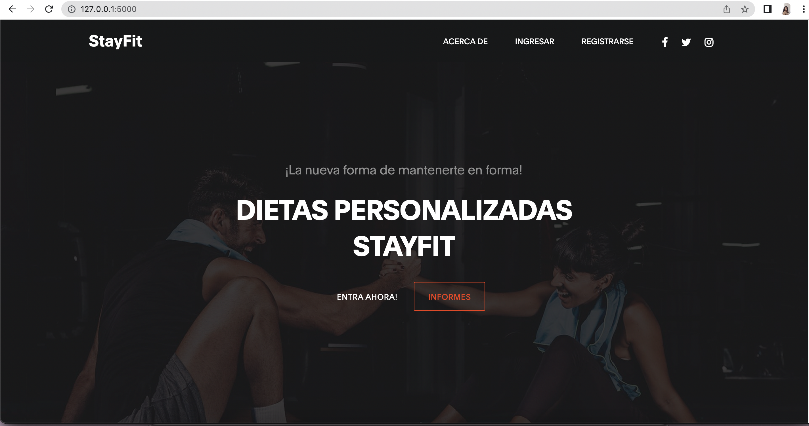
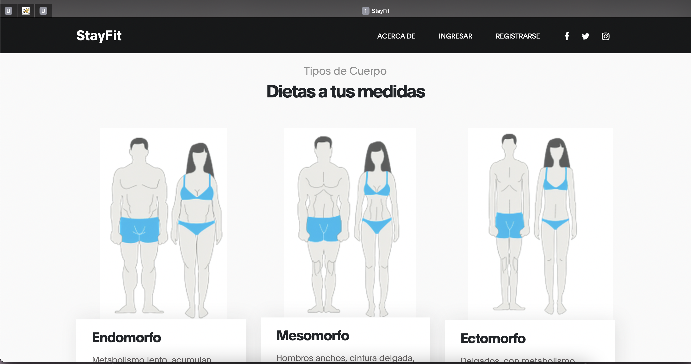
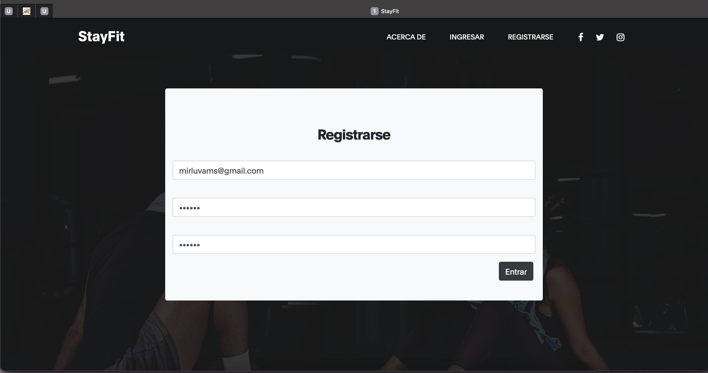
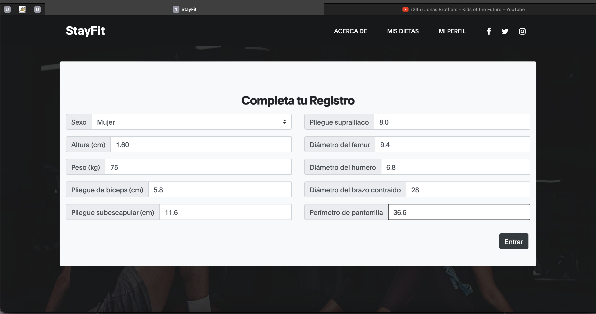
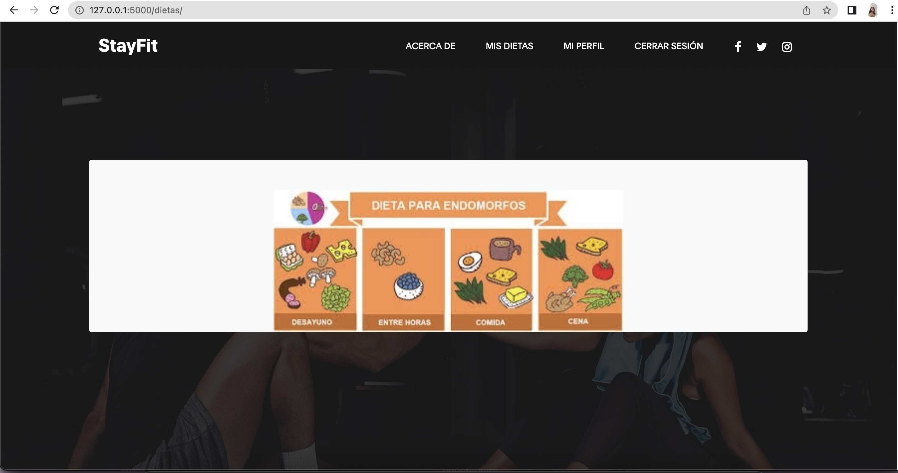
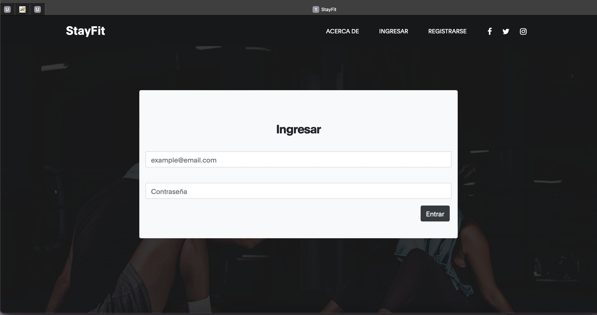

# StayFit

## Sobre el proyecto
Proyecto final de la clase de Ingeniería de Software 2022-2, impartida por el Dr. José Alfredo Noriega Carmona en la [Universidad Nacional  Autónoma de México](https://www.unam.mx/), en su Escuela Nacional de Estudios Superiores, Campus (ENES Morelia), como parte del plan nivel licenciatura de Tecnologías para la Información en Ciencias.
> 
> Luis Tiburcio Arely Hilda  ([areelu](https://github.com/areelu))
> 
> Carreón Hernández Ana Paola ([mordran](https://github.com/mordran))
> 
> Tapia Figueroa Leonardo Ariel ([leotapia11](https://github.com/leotapia11))
> 
> Tolentino Díaz Débora Joselyn ([debytdiaz](https://github.com/Debytd))
> 
> Aceves Sierra David Alberto  

# Manual de usuario

## Tabla de Contenidos
* Introducción
* Sobre el uso de la documentación
* Conceptos de las operaciones - Modo Instruccional
* Procedimientos - Modo Referencial
* Características de navegación

## Introducción
Este proyecto esta dirigido a todas aquellas personas que esten interesadas en el cuidado de su cuerpo. En este repositorio encontrarás una aplicación con la cual podrás ingresar información acerca de tu cuerpo, y a cambio te regresará el tipo de éste (ectomorfo, endomorfo y mesomorfo), además de contar con una dieta adecuada a tus requierimientos calóricos.

## Información para el uso de la documentación

* Aviso nutricional
- El uso de esta plataforma es responsabilidad del usuario.
- No fomentamos el autodiagnostico.
- Consulte a su médico.

## Concepto de las operaciones
Al inicio al abrir el aplicativo la primera pantalla inicial que veras será la de a continuación en la cual verás varios botones ademas de que en la misma ventanas podras deslizar hacia abajo 

Al deslizar en la ventana principal hacia la parte de abajo encontraras las siguientes imagenes las cuales te presentan información sobre los tres tipos de cuerpos que puedes tener como resultado utilizando la app

Regresando a el incio deslizando hacia arriba podemor tener a el siguiente paso del procedimiento para el uso del aplicativo el cual es registrarse clickeando a traves del botón que está en la barra superior que se llama exactamente igual que la opción dando como resultado el siguiente menú donde ingresarás tu correo y contraseña y en el ultimo confirmaras tu contraseña de nuevo si estas no coinciden no te registrará

 
### Procedimientos - Modo Referencial
Para empezar a utilizar la aplicación de StayFit se debe de descargar la carpeta principal de la documentación de arriba, ademas de python, pyflask y sqlite. Se descomprime y a continuación desde la terminal dentro de la carpeta se ejecutan los comandos '$ env:FLASK_APP = "main.py", segudo de "flask run"; de ésta manera se desplegará en tu navegador la pantalla principal del aplicativo y podrás comenzar a emplearlo.

### Características de Navegación
* Graphic window: with a simple interface design to avoid confusion and difficulties for the users.
